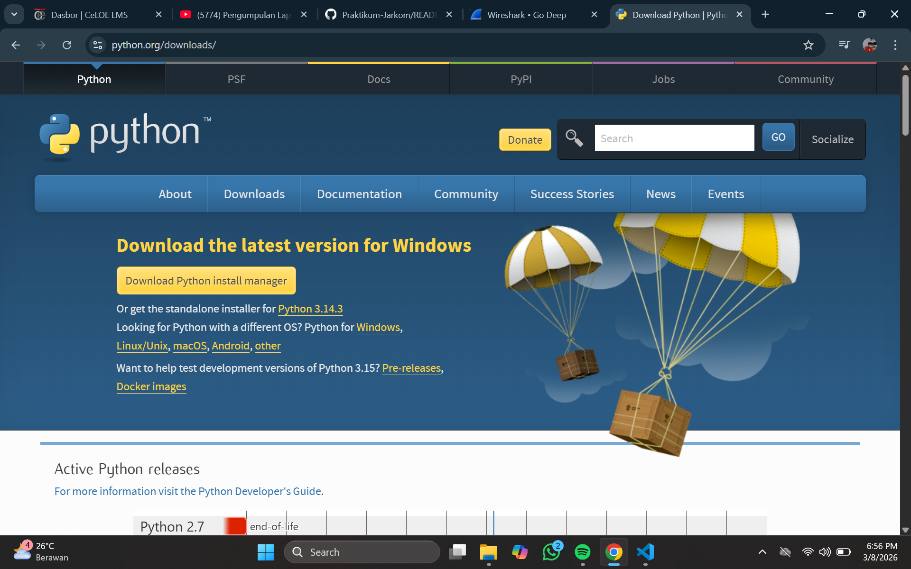
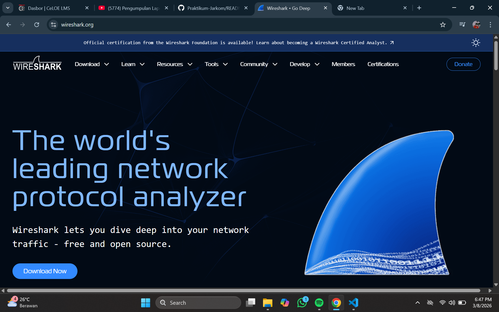

# Laporan1 Praktikum Jarkom IF

# Modul 1_Running Modul
1. disini kita pastikan tools wireshark dan python sudah terinstall di masing-masing komputer
2. jika belum terinstall maka kita perlu menginstallnya terlebih dahulu
    - wireshark : http://www.wireshark.org/
    - python : https://www.python.org/donwloads/

# Lampiran 
1. Python 
2. Wireshark 