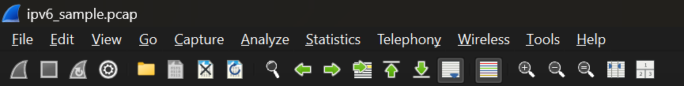
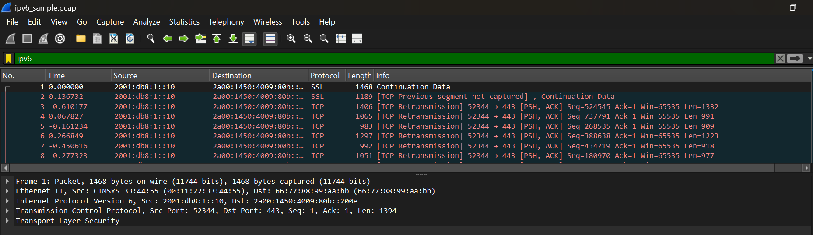

## Nazriel Irham Pratama Putra - 103072400062 - IF0405
# MODUL 10 : IP
## IP
IP Address (Internet Protocol Address) merupakan identitas khusus yang dimiliki setiap perangkat pada suatu jaringan, baik jaringan lokal maupun internet. Alamat ini digunakan agar proses pengiriman dan penerimaan data dapat berjalan menuju perangkat yang tepat, layaknya alamat rumah untuk menentukan tujuan pengiriman.

**Jenis-jenis**
- IPv4 : menggunakan 32-bit (contoh: 192.168.1.1)
- IPv6 : menggunakan 128-bit (contoh: 2001:db8::1)

**Cara menghitung**

IPv4 terdiri dari 4 oktet (masing-masing 8 bit) ex : 192.168.1.1
- 192 = 11000000
- 168 = 10101000
- 1 = 00000001

Subnetting adalah teknik yang digunakan untuk membagi sebuah jaringan menjadi beberapa bagian, sehingga dapat memisahkan antara Network ID sebagai penanda jaringan dan Host ID sebagai identitas perangkat di dalam jaringan tersebut.

**Melihat IP Address**

1. Buka Command Prompt (CMD) pada komputer
2. Ketik perintah `ipconfig`, lalu tekan Enter

Perangkat pada jaringan Wi-Fi menggunakan IP Address **10.38.183.48** dengan subnet mask **255.255.255.0** atau **/24**. Alamat tersebut digunakan untuk mengidentifikasi perangkat di dalam jaringan lokal. Network ID dari jaringan ini adalah **10.38.183.0**, sedangkan jumlah host yang dapat digunakan dalam satu jaringan mencapai **254 perangkat**. Default gateway yang digunakan adalah **10.38.183.92** sebagai penghubung perangkat ke jaringan lain atau internet. Selain IPv4, perangkat juga memiliki alamat **IPv6** dengan jenis **link-local** yang diawali dengan "fe80::".

## Traceroute
Traceroute merupakan metode yang digunakan untuk melacak rute perjalanan paket data dari perangkat pengguna menuju alamat tujuan tertentu, seperti server atau website di internet.

**Fungsi Traceroute**
- Menunjukkan jalur router atau hop yang dilalui paket data
- Mengukur waktu yang dibutuhkan pada setiap hop
- Membantu menemukan masalah atau gangguan pada jaringan

**Mengamati Traceroute dari suatu Website**
1. Buka CMD
2. Ketik tracert google.com

Hasil traceroute menunjukkan bahwa paket data berhasil dikirim menuju server Google dengan alamat IPv6 **2404:6800:4003:c04::66**. Pada hop pertama, paket melewati router lokal dengan waktu respon sekitar **4 ms hingga 33 ms**. Selanjutnya paket melewati beberapa jaringan internal dengan waktu tempuh sekitar **66 ms sampai 148 ms**, sementara beberapa hop menampilkan pesan **Request Timed Out** karena router tidak merespons traceroute. Pada hop ke-30, paket berhasil mencapai server Google dengan hostname **si-in-f102.1e100.net** dan waktu respon sekitar **101 ms hingga 117 ms**. Hal ini menunjukkan bahwa koneksi jaringan masih berjalan dengan baik meskipun beberapa router tidak memberikan balasan.

## IMCP, MTU, TTL
**ICMP (Internet Control Message Protocol)**
merupakan protokol jaringan yang berfungsi untuk mengirimkan informasi dan pesan kontrol antar perangkat dalam jaringan. Protokol ini biasanya digunakan untuk memeriksa koneksi jaringan melalui perintah *ping*, memberikan notifikasi kesalahan pada proses pengiriman data, serta membantu proses pelacakan jalur jaringan pada traceroute.

**MTU (Maximum Transmission Unit)**
MTU adalah batas ukuran terbesar paket data yang dapat dikirim dalam satu proses transmisi pada jaringan. Sebagai contoh, jaringan Ethernet umumnya memiliki MTU sebesar 1500 byte. Jika ukuran paket melebihi batas tersebut, maka paket akan dipecah menjadi beberapa bagian atau mengalami fragmentasi.

**TTL (Time to Live)**
merupakan nilai yang menentukan batas jumlah router atau hop yang dapat dilewati oleh sebuah paket data. Setiap kali paket melewati router, nilai TTL akan berkurang satu. Apabila nilai TTL mencapai 0, paket akan dihentikan atau dibuang oleh router. Mekanisme ini digunakan untuk mencegah terjadinya perulangan jalur data (looping) di dalam jaringan.

## Fragmentasi
Fragmentasi merupakan proses membagi paket data menjadi beberapa bagian yang lebih kecil ketika ukuran paket melebihi batas MTU (*Maximum Transmission Unit*) pada jaringan. Hal ini biasanya terjadi saat paket data melewati jaringan yang memiliki kapasitas MTU lebih kecil dibanding ukuran paket yang dikirim.

**Percobaan Fragmentasi**
1. Jalankan Wireshark pilih interface Wifi yang aktif
2. Klik Start
3. Buka CMD
4. Ketik ping google.com -l 2000 (mengirim paket besar (2000 byte) yg melebihi MTU sehingga memicu fragmentasi)
5. Kembali ke Wireshark, gunakan filter ip.flags.mf == 1 || ip.frag_offset > 0

Berdasarkan hasil capture menggunakan Wireshark, ditemukan paket dengan keterangan:

- “Fragmented IP protocol (proto=ICMP 1)” yang menunjukkan terjadinya proses fragmentasi pada paket ICMP.
- Paket yang dikirim memiliki ukuran sebesar 1514 bytes, sehingga melebihi batas MTU standar Ethernet sekitar 1500 bytes.
- Pada paket juga terdapat nilai Identification seperti ID=4ced, ID=4cee, ID=4cef, dan ID=4cf0 yang menandakan bahwa setiap fragment berasal dari paket yang sama.
- Nilai Fragment Offset (off=0) menunjukkan bahwa paket tersebut merupakan fragment pertama.
- Selain itu, terdapat keterangan “Reassembled in #359”, “#364”, “#392”, dan “#456” yang menandakan bahwa fragment berhasil digabung kembali oleh sistem tujuan.

Dari hasil tersebut dapat disimpulkan bahwa paket ICMP mengalami fragmentasi karena ukuran paket melebihi batas MTU jaringan.

## IPv6
IPv6 (*Internet Protocol version 6*) merupakan pengembangan terbaru dari protokol IP yang dirancang sebagai penerus IPv4. IPv6 menggunakan alamat berukuran **128-bit** dan penulisannya memakai format bilangan heksadesimal yang dipisahkan dengan tanda titik dua (":").

**Analisis IPv6 di Wireshark**
1. Membuka file ipv6_sample dengan wireshark

2. Gunakan filter IPv6

Berdasarkan hasil capture menggunakan Wireshark, ditemukan paket dengan protokol IPv6. Hal ini dibuktikan dengan adanya informasi:

- Hal ini dibuktikan dengan adanya informasi Internet Protocol Version 6 pada detail paket.
- Alamat source yang digunakan adalah 2001:db8:1::10, sedangkan alamat destination adalah 2a00:1450:4009:80b::200e.
- Kedua alamat tersebut menggunakan format heksadesimal dengan tanda titik dua (:) yang menjadi ciri khas IPv6.
- Pada paket juga terlihat penggunaan protokol TCP dengan tujuan port 443 (HTTPS) yang menunjukkan adanya komunikasi layanan web.
- Selain itu, ditemukan beberapa paket dengan keterangan TCP Retransmission yang menandakan adanya pengiriman ulang paket data.

Dari hasil tersebut dapat disimpulkan bahwa komunikasi jaringan menggunakan IPv6 berhasil diamati dan digunakan dalam akses layanan web.
