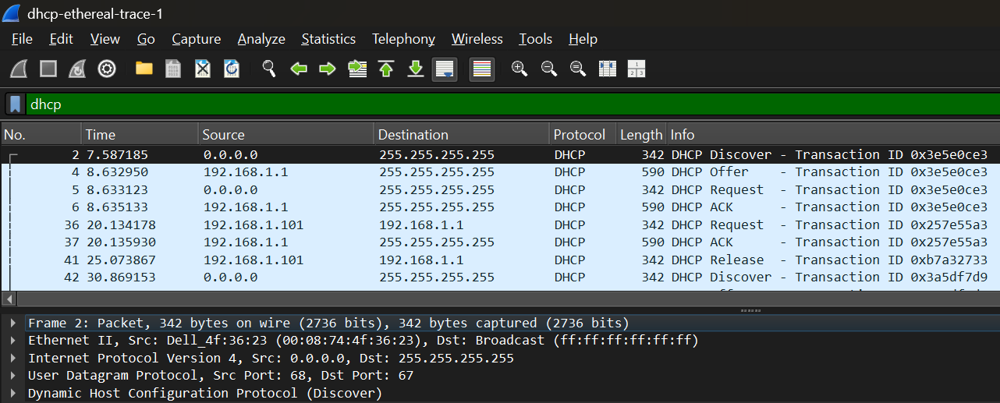

## Nazriel Irham Pratama Putra - 103072400062 - IF0405
# MODUL 11 : DHCP
## DHCP

DHCP (Dynamic Host Configuration Protocol) adalah sistem yang mengotomatiskan pengelolaan konfigurasi perangkat dalam jaringan. Protokol ini secara mandiri membagikan parameter penting seperti IP address, gateway, subnet mask, dan DNS server, sehingga proses koneksi gawai menjadi lebih praktis tanpa perlu konfigurasi manual.

## Kelebihan DHCP
1. Pemberian IP address berlangsung otomatis dan cepat.
2. Mempermudah pengelolaan jaringan.
3. Mencegah konflik IP address yang sama.
4. Mengurangi risiko kesalahan konfigurasi IP address.
5. Efisien untuk jaringan dengan banyak perangkat.

## Kekurangan DHCP
1. Perangkat lebih sulit dikenali karena IP dapat berubah otomatis.
2. Memerlukan pengaturan tambahan pada server DHCP.
3. Klien tidak mendapat IP jika server DHCP bermasalah.
4. Keamanan jaringan bisa menurun jika konfigurasi tidak tepat.

## Proses DORA
DORA adalah proses komunikasi antara DHCP client dan DHCP server untuk mendapatkan alamat IP secara otomatis. Tahapan ini meliputi Discover, Offer, Request, dan Acknowledgement (ACK).

**Langkah-langkah**
1. Download dan ekstrak file http://gaia.cs.umass.edu/wireshark-labs/wireshark-traces.zip
2. Buka file DHCP menggunakan Wireshark.

3. Gunakan filter dhcp untuk menampilkan paket DHCP saja.

**Tahapan Dora**
1. Discover
Pada tahap awal, client mengirim paket DHCP Discover untuk mencari server DHCP yang aktif di jaringan. Alamat IP sumber masih 0.0.0.0 karena client belum memperoleh IP address. Paket dikirim secara broadcast agar semua server DHCP dapat menerimanya.
2. Offer
Setelah menerima pesan Discover, server DHCP membalas dengan DHCP Offer yang berisi penawaran alamat IP serta informasi konfigurasi jaringan lainnya untuk client.
3. Request
Client kemudian memilih salah satu IP yang ditawarkan dan mengirimkan DHCP Request sebagai tanda persetujuan terhadap alamat IP tersebut.
4. Acknowledgement (ACK)
Server DHCP mengirim DHCP ACK untuk menyetujui permintaan client dan memastikan bahwa IP address telah berhasil diberikan sehingga perangkat dapat terhubung ke jaringan.

**Kesimpulan**
Proses DORA pada DHCP memungkinkan perangkat memperoleh IP address secara otomatis melalui tahapan Discover, Offer, Request, dan Acknowledgement. Mekanisme ini membuat konfigurasi jaringan menjadi lebih mudah, cepat, dan mengurangi risiko kesalahan pengaturan IP address.
