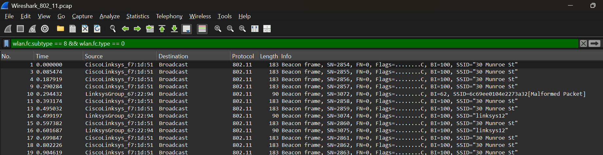
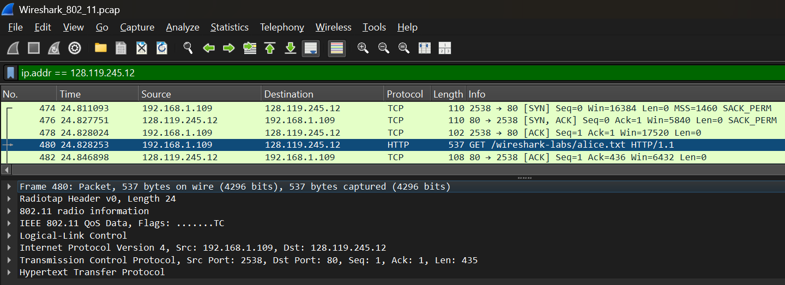

## Nazriel Irham Pratama Putra - 103072400062 - IF0405
# MODUL 14 WIFI

## Dasar Teori
**IEEE 802.11** adalah standar internasional untuk teknologi jaringan Wi-Fi. Standar ini dibuat oleh Institute of Electrical and Electronics Engineers (IEEE) dan menentukan cara perangkat nirkabel mengirim dan menerima data melalui gelombang radio.Dengan begitu, perangkat Wi-Fi dapat berkomunikasi dengan lancar, handal, dan kompatibel satu sama lain. Standar ini juga mengatur dua aspek penting, yaitu Physical Layer dan MAC Layer.Physical Layer berkaitan dengan transmisi data melalui gelombang radio, sedangkan MAC Layer mengatur cara perangkat mengakses dan menggunakan jaringan. Kedua aspek ini sangat penting untuk memastikan komunikasi yang stabil dan efektif.Dengan adanya standar IEEE 802.11, perangkat Wi-Fi dapat bekerja sama dengan baik dan memberikan koneksi internet yang cepat dan handal.

**Perbandingan Frekuensi Jaringan Wi-Fi**
1. Frekuensi 2.4 GHz
   - Kelebihan : Memiliki cakupan sinyal yang lebih luas sehingga dapat menjangkau area yang lebih besar. Selain itu, sinyal pada frekuensi ini lebih efektif melewati hambatan fisik seperti tembok, pintu, dan furnitur.
   - Kekurangan : Laju transmisi data cenderung lebih rendah dibandingkan frekuensi yang lebih tinggi. Frekuensi ini juga lebih mudah mengalami gangguan karena digunakan oleh banyak perangkat lain, seperti Bluetooth, microwave, dan perangkat nirkabel rumah tangga.
2. Frekuensi 5 GHz
   - Kelebihan : Kecepatan transfer data yang lebih tinggi serta koneksi yang lebih stabil karena tingkat interferensinya lebih rendah. Cocok digunakan untuk aktivitas yang membutuhkan bandwidth besar, seperti streaming video berkualitas tinggi dan bermain game online.
   - Kekurangan : Area jangkauan sinyal lebih terbatas dibandingkan frekuensi 2,4 GHz. Selain itu, kemampuannya dalam menembus penghalang fisik, terutama dinding tebal atau beton, relatif kurang baik sehingga kualitas sinyal dapat menurun pada jarak yang lebih jauh.

**Access Point (AP)** berfungsi sebagai penghubung antara perangkat nirkabel dan jaringan kabel. AP juga memancarkan sinyal Wi-Fi sehingga perangkat di area yang tidak terjangkau kabel dapat tetap terhubung ke jaringan.

Untuk analisis lebih lanjut, praktikum diawali dengan mengunduh dan mengekstrak berkas ZIP yang berisi data aktivitas Wireshark dari tautan laboratorium yang telah disediakan: http://gaia.cs.umass.edu/wireshark-labs/wireshark-traces.zip. Buka berkas pelacakan bernama Wireshark_802_11.pcap menggunakan aplikasi Wireshark.

## Analisis Beacon Frame
Fungsi Utama: Access Point secara berkala mengirimkan Beacon Frame untuk memberi tahu perangkat di sekitarnya bahwa jaringan Wi-Fi tersedia. Informasi yang dikirim mencakup **SSID** dan parameter jaringan lainnya, sehingga perangkat dapat mendeteksi serta terhubung ke jaringan tersebut.

Untuk memfilter Beacon Frame, digunakan perintah ekspresi filter pada Wireshark: wlan.fc.subtype == 8 && wlan.fc.type == 0

Dari data yang dikumpulkan dengan menggunakan Wireshark, kita dapat melihat bahwa Beacon Frame dikirim secara teratur dengan jarak waktu sekitar 8 milidetik. Dalam waktu pengamatan selama 73 detik, ada sebanyak 2363 Beacon Frame yang berhasil dikirim.
.png)

Berdasarkan ekspansi detail paket pada Frame 3, ditemukan parameter-parameter berikut:  
- PHY Type (802.11b (HR/DSSS)): Menunjukkan bahwa jaringan menggunakan standar fisik IEEE 802.11b dengan teknologi modulasi High-Rate Direct Sequence Spread Spectrum (HR/DSSS).
- Short Preamble (False): Menandakan penggunaan Long Preamble sebagai mekanisme sinkronisasi awal frame. Pengaturan ini lebih mengutamakan kompatibilitas dengan perangkat lama.
- Channel (6) / Frequency (2437MHz): Access Point beroperasi pada kanal 6 dengan frekuensi 2437 MHz di pita 2,4 GHz.
- Signal Strength / Noise Level: Sinyal yang diterima memiliki kekuatan sekitar -30 dBm, yang menunjukkan kualitas sangat baik, sedangkan tingkat noise berada di -100 dBm, menandakan gangguan yang sangat rendah.

Analisis Tagged Parameters
- Tag: SSID parameter set: Berisi nama jaringan Wi-Fi yang dipancarkan, yaitu "30 Munroe St".
- Tag: Supported Rates: Menunjukkan kecepatan data yang didukung secara dasar oleh Access Point, yaitu 1, 2, 5,5, dan 11 Mbps.
- Tag: Extended Supported Rates: Extended Supported Rates: Menampilkan daftar kecepatan tambahan yang tersedia pada standar yang lebih baru, mulai dari 6 Mbps hingga 54 Mbps.

## Analisis Data Transfer
Untuk menganalisis perpindahan data, diterapkan filter alamat IP server: Untuk menganalisis perpindahan data, diterapkan filter alamat IP server:

Hasil pengamatan menunjukkan adanya proses pembentukan koneksi TCP melalui tahapan Three-Way Handshake, yaitu SYN, SYN-ACK, dan ACK. Setelah koneksi berhasil dibuat, pada Frame 480 terlihat paket HTTP GET yang digunakan untuk meminta dan mengunduh berkas teks `/wireshark-labs/alice.txt`.

Analisis Protokol: Paket yang dikirim terlebih dahulu melewati lapisan Logical Link Control (LLC) sebelum diteruskan menggunakan Internet Protocol Version 4 (IPv4). Pada komunikasi tersebut, perangkat klien menggunakan alamat IP 192.168.1.109, sedangkan server tujuan memiliki alamat IP 128.119.245.12.

## Analisis Proses Association & Disassociation
- Association (Asosiasi): Merupakan proses jabat tangan (handshake) Proses pendaftaran perangkat ke Access Point agar dapat terhubung dan menggunakan jaringan Wi-Fi.
- Disassociation (Disasosiasi): Proses berakhirnya koneksi antara klien dan Access Point, yang dapat terjadi karena permintaan dari klien atau karena AP menghentikan koneksi, misalnya saat perangkat berpindah ke jaringan lain (roaming).

Untuk mengamati proses manajemen koneksi pada jaringan nirkabel, digunakan filter wlan.fc.type_subtype == 0 sehingga paket yang berkaitan dengan mekanisme handshake dapat ditampilkan dan dianalisis.
- expand paket awal

- expand paket akhir

Dari perbandingan dua paket Association Request, terlihat adanya perubahan jaringan tujuan yang dipilih oleh klien. Pada Frame 1750, perangkat mengirim permintaan koneksi ke Access Point dengan SSID "linksys_SES_24086". Namun, pada Frame 2162, perangkat mengirim Association Request ke SSID yang berbeda, yaitu "30 Munroe St". Perubahan ini menunjukkan bahwa klien telah berpindah atau memilih untuk terhubung ke Access Point lain.

Tanggapan Asosiasi (Association Response) dianalisis melalui filter subtype respon: wlan.fc.type_subtype == 1
.png)
Ditemukan Frame 2166 yang merupakan paket Association Response. Pada frame ini, alamat pengirim, yaitu Transmitter Address dan Source Address, adalah CiscoLinksys_f7:1d:51, yang menunjukkan bahwa Access Point mengirimkan respons kepada perangkat klien Intel_d1:b6:4f. Hal ini menandakan bahwa permintaan asosiasi yang sebelumnya dikirim oleh klien telah diterima dan koneksi berhasil dibentuk.

Berdasarkan detail paket, nilai Status Code menunjukkan kondisi Successful, yang berarti proses asosiasi berlangsung tanpa kesalahan. Selain itu, Access Point juga mengirimkan informasi mengenai kecepatan transfer data yang didukung melalui parameter Supported Rates dan Extended Supported Rates, yaitu mulai dari 1 Mbps hingga 54 Mbps. Paket ini juga memuat EDCA Parameter Set yang digunakan untuk mengatur mekanisme Quality of Service, sehingga lalu lintas data seperti suara, video, dan data biasa dapat diprioritaskan sesuai kebutuhannya. Dengan diterimanya Association Response ini, klien resmi terdaftar pada Access Point dan dapat melanjutkan proses komunikasi data melalui jaringan nirkabel tersebut.
