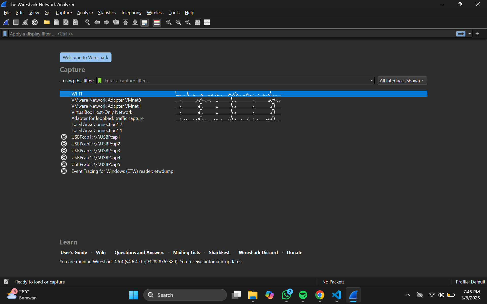
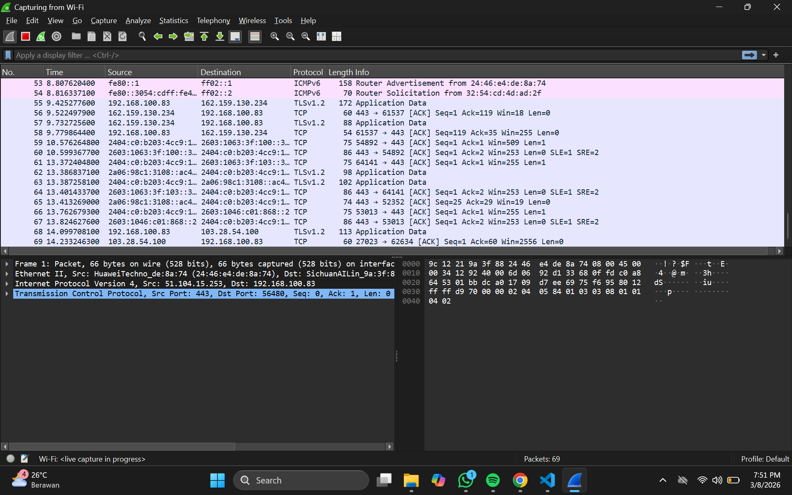
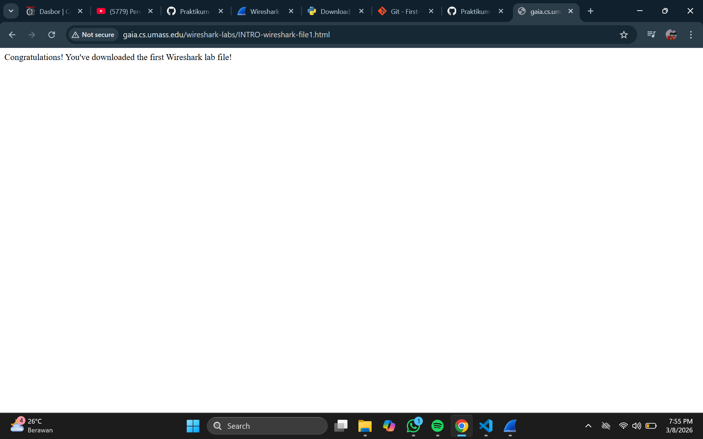
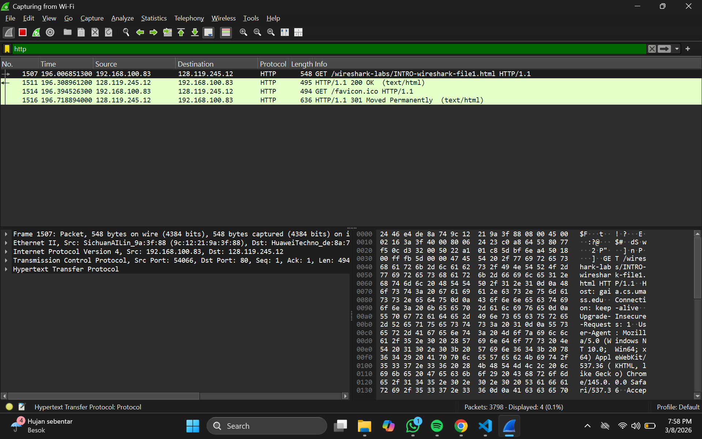

# Laporan 2 Praktikum Jarkom IF

# Modul 2_Pengenalan Tools
1. Buka aplikasi wireshark yang telah di install
2. di bagian gambar, akan muncul daftar interface jaringan seperti :
    - Wi-fi
    - Virtualbox Host-Only Network
    - dsb
    # Lampiran
    Tampilan depan wireshark setelah di buka 
3. Lalu pilih interface yang sedang dipakai internet
    contoh :
    - jika pilih Wi-fi -> pilih Wi-fi
    - Jika pilih Virtualbox Host-Only Network -> pilih Virtualbox Host-Only Network
Sebagai contoh, disini saya akan memilih Wi-fi
# Lampiran
Tampilan Wi-fi 
Bisa dilihat disini pada lampiran diatas menunjukkan bahwa wireshark sedang merekam aktivitas yang sedang berjalan dalam interface wi-fi.
4. Selanjutnya, sebagai contoh kita bisa masukkan URL : http://gaia.cs.umass.edu/wireshark-labs/INTRO-wireshark-file1.html pada chrome dan tampilannya akan seperti lampiran dibawah ini.
# Lampiran
Tampilan Umass Edu Wireshark 
5. Setelah browser menampilkan kalimat "Congratulations!" selanjutnya kita kembali ke Wireshark dan mengetik "http" di pencarian.
Tampilan Pencarian http di Wireshark 
