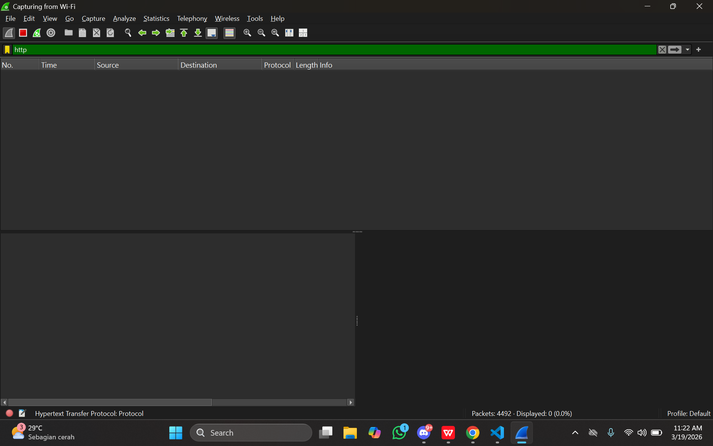
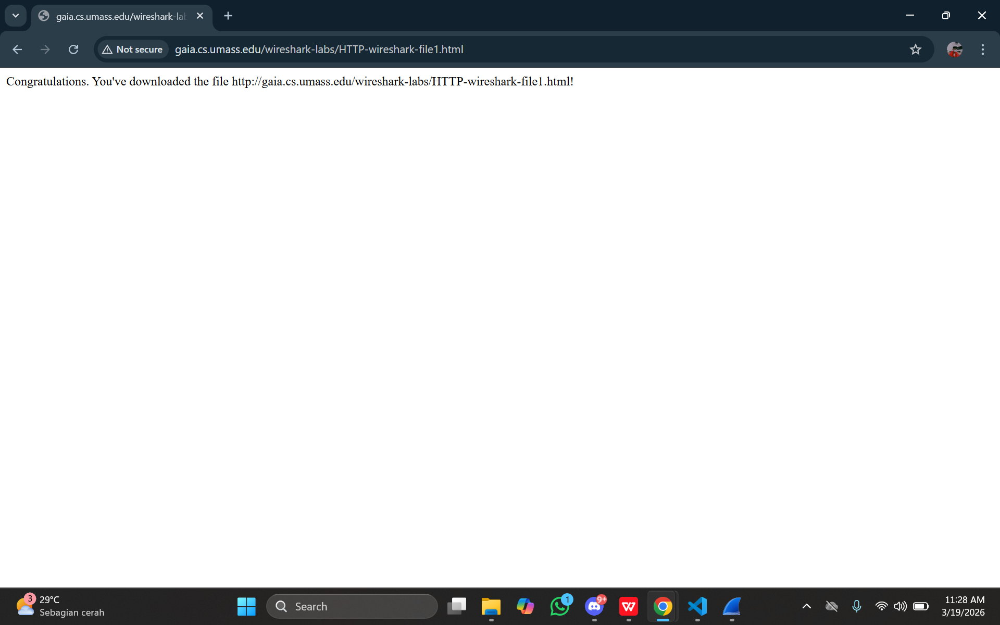
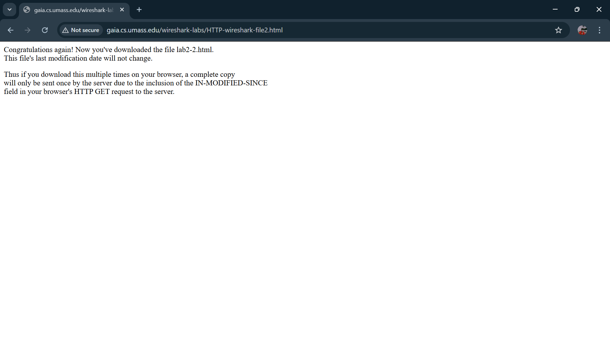
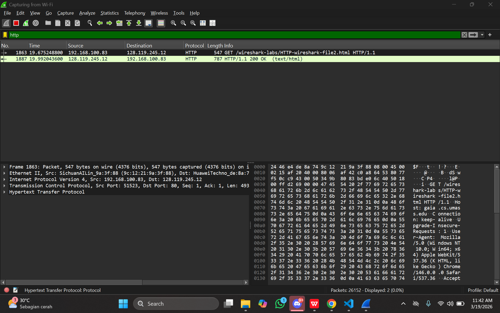
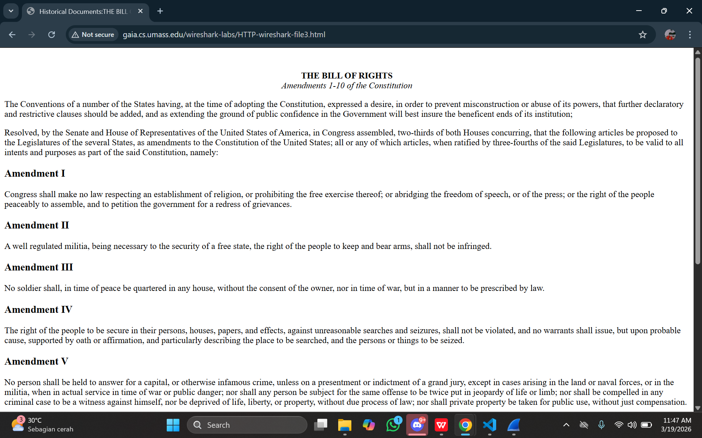
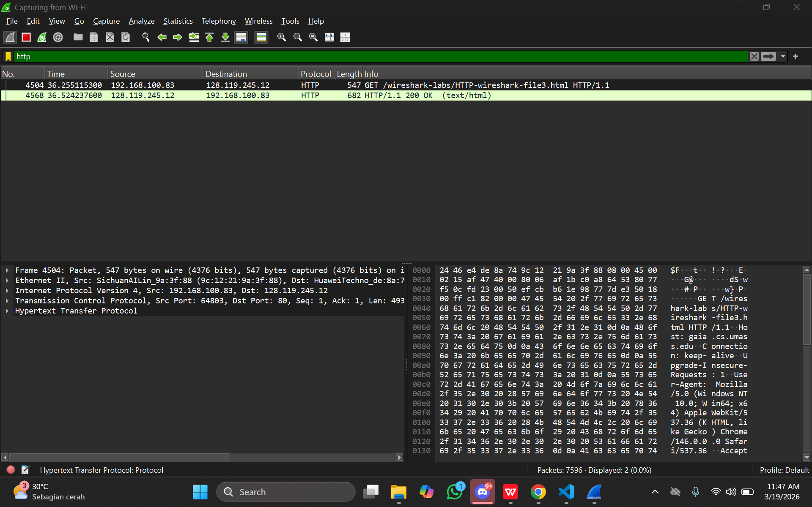
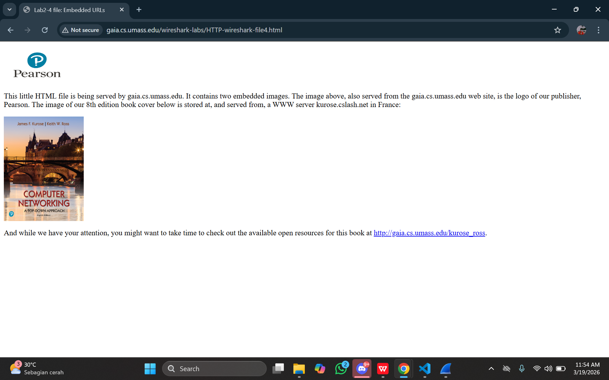
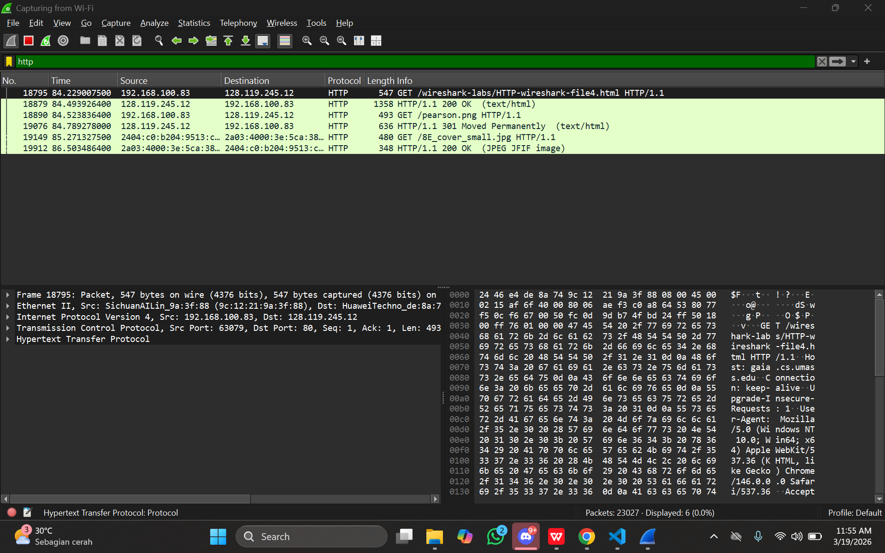
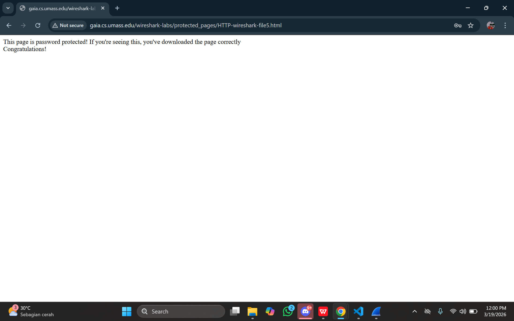
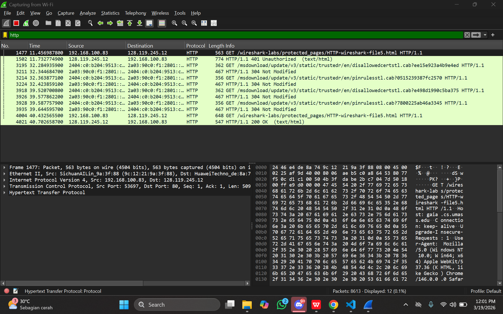

# Laporan Praktikum Jarkom IF

# Modul 3_HTTP

3.1 Basic HTTP GET/response
1. Pilih Interface: Buka Wireshark dan pilih adaptor jaringan yang aktif (misal: Wi-Fi atau Ethernet).
2. Filter Protokol: Masukkan kata kunci http pada kolom display filter di bagian atas agar hanya lalu lintas HTTP yang muncul.
3. Mulai Capture: Jalankan proses capture paket dan biarkan stabil selama sekitar satu menit sebelum beralih ke browser.
4. Akses URL: Buka browser dan kunjungi alamat:
http://gaia.cs.umass.edu/wireshark-labs/HTTP-wireshark-file1.html
Hentikan Proses: Setelah halaman termuat, kembali ke Wireshark dan tekan tombol Stop (ikon kotak merah) untuk mengakhiri pengambilan data.

# Lampiran
Pencarian http di tools WiFi 
Tampilan berhasil Umass Edu di Chrome 
Tampilan hasil browser di tools WiFi 

3.2 HTTP CONDITIONAL GET
1. Kita bersihkan cache browser terlebih dahulu
2. Kemudian kita mulai Wireshark lagi
3. Buka: http://gaia.cs.umass.edu/wireshark-labs/HTTP-wireshark-file2.html
4. Refresh halaman (atau buka URL yang sama lagi)
5. Stop capture, filter dengan "http"

# Lampiran
Tampilan Umass edu link (2) 
Tampilan http link (2) 

3.3 Retrieving Long Documents
1. Bersihkan cache browser dahulu
2. Mulai capture Wireshark
3. Buka: http://gaia.cs.umass.edu/wireshark-labs/HTTP-wireshark-file3.html
4. Stop capture, filter "http"

# Lampiran
Tampilan Umass edu link (3) 
Tampilan http link (3) 

3.4 HTML dengan Embedded Objects
1. HTML dengan Embedded Objects
2. Mulai capture Wireshark
3. Buka: http://gaia.cs.umass.edu/wireshark-labs/HTTP-wireshark-file4.html
4. Stop capture, filter "http"

# Lampiran
Tampilan Umass edu link (4) 
Tampilan http link (4) 

3.5 HTTP Authentication
1. Bersihkan cache browser terlebih dahulu
2. Mulai capture Wireshark
3. Buka: http://gaia.cs.umass.edu/wireshark-labs/protected_pages/HTTP-wireshark-file5.html
    Username: wireshark-students
    Password: network
4. Stop capture, filter "http"

# Lampiran
Tampilan Umass edu link (5) 
Tampilan http link (5) 
