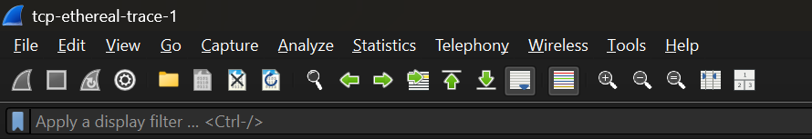

## Nazriel Irham Pratama Putra - 103072400062 - IF0405

# MODUL 6 : TCP
## TCP
TCP (Transmission Control Protocol) merupakan protokol pada lapisan transport yang bekerja secara connection-oriented, yaitu membutuhkan proses pembentukan koneksi terlebih dahulu sebelum data dikirimkan. Protokol ini memastikan data dapat diterima dengan andal melalui berbagai mekanisme seperti sequence number untuk penomoran data, acknowledgment sebagai tanda penerimaan, serta pengaturan flow control dan congestion control untuk menjaga kestabilan pengiriman data.

## Analisis Transfer File Menggunakan Protokol TCP
**Langkah-langkah**
1. Download file http://gaia.cs.umass.edu/wireshark-labs/alice.txt

2. Buka browser http://gaia.cs.umass.edu/wireshark-labs/TCP-wireshark-file1.html dan pilih file alice.txt

3. Buka wireshark, pilih wifi, aktifkan (start)

4. Kembali ke browser klik Upload alice.txt hingga muncul tampilan “Congratulations”

5. Stop wireshark dan lakukan filter "tcp"
Terlihat bahwa paket yang ditangkap mencakup segmen TCP serta beberapa paket HTTP. Hal ini menandakan bahwa proses upload file memanfaatkan protokol HTTP yang beroperasi di atas lapisan TCP.

Paket SYN berfungsi untuk menginisiasi koneksi TCP antara client dan server dalam proses three-way handshake, bukan untuk proses pengiriman file. Tahap ini memastikan bahwa koneksi sudah siap sebelum pertukaran data dilakukan. Setelah koneksi terbentuk, file akan dikirim melalui TCP dalam bentuk beberapa segmen kecil. Hal ini dilakukan karena TCP memecah data menjadi bagian-bagian yang lebih kecil agar proses pengiriman menjadi lebih efisien dan terkontrol.

Setelah proses upload selesai, server memberikan respons berupa HTTP/1.1 200 OK. Respons ini menunjukkan bahwa file telah berhasil diterima dan diproses dengan baik oleh server. Selanjutnya, halaman web menampilkan pesan “Congratulations” sebagai tanda bahwa proses upload telah berjalan sukses.

**Pertanyaan**
1. IP dan port TCP komputer klien 
mencari data di filter "HTTP" dan pilih paket POST

- IP server : 192.168.100.83
- Port server : 52162

2. IP dan port TCP server
mencari data di filter "HTTP" dan pilih paket HTTP/1.1 200 OK

- IP server : 128.119.245.12
- Port server : 80

## Dasar TCP
**Langkah-langkah**
1. Download dan extrak file http://gaia.cs.umass.edu/wireshark-labs/wireshark-traces.zip
2. Buka file dan pilih paket paket tcp-ethereal-trace-1, buka dengan wireshark

**Pertanyaan**
1. Nomor urut SYN, mencari data di filter tcp.flags.syn == 1 && tcp.flags.ack == 0

Nomor urut (sequence number) pada segmen TCP SYN bernilai 0. Segmen tersebut dikenali sebagai paket SYN karena adanya flag SYN yang aktif pada bagian TCP Flags.

2. SYN-ACK, mencari data di filter tcp.flags.syn == 1 && tcp.flags.ack == 1

Pada segmen SYN-ACK, nilai sequence number adalah 0, sementara acknowledgment bernilai 1. Nilai acknowledgment tersebut berasal dari sequence number pada segmen SYN sebelumnya yang ditambah satu. Segmen ini dikenali sebagai SYN-ACK karena pada bagian TCP Flags terdapat flag SYN dan ACK yang aktif.

3. Sequence number POST, mencari data di filter tcp.port == 1161 && tcp contains "POST"

Nomor urut (sequence number) pada segmen TCP yang membawa perintah HTTP POST bernilai 1.

4. 6 segmen pertama + RTT

Nilai RTT dihitung dari selisih waktu antara saat segmen TCP dikirim dan saat acknowledgment diterima. Berdasarkan grafik Round Trip Time, besar RTT berada pada kisaran sekitar 100 ms hingga 300 ms. Variasi nilai RTT ini dipengaruhi oleh kondisi jaringan selama proses transmisi berlangsung.

5. Panjang 6 segmen

Panjang 6 segmen adalah 7.865 byte

6. Buffer receiver

Nilai minimum ruang buffer yang tersedia di sisi penerima adalah sebesar 5840 byte, yang dapat diketahui dari nilai window size pada segmen TCP.

7. Retransmission

Tidak ditemukan retransmission / ditemukan retransmission. Hal ini dapat dilihat dari tidak adanya / adanya label “TCP Retransmission” pada Wireshark.

8. ACK behavior

Jumlah data yang di-ACK tidak tetap dan bisa banyak. Penerima dapat mengakui beberapa segmen sekaligus, tidak selalu satu per satu

9. Thoroughtput
 
Throughput merupakan jumlah data yang berhasil ditransfer dalam satuan waktu tertentu. Berdasarkan grafik throughput, laju transfer terlihat meningkat secara bertahap hingga berada pada kisaran sekitar 200 kbps sampai 270 kbps. Hal ini mencerminkan kinerja koneksi TCP selama proses pengiriman data berlangsung.

## Congestion Control pada TCP 
**Peertanyaan dan Langkah-langkah**
1. Buka file tcp-ethereal-trace-1 menggunakan Wireshark
Buka filter “TCP” untuk menampilkan paket yang relevan
Pilih menu Statistics → TCP Stream Graph → Time-Sequence Graph (Stevens) untuk melihat pola pengiriman data dan mengidentifikasi kedua fase tersebut.

Fase slow start terjadi pada awal koneksi (sekitar 0 hingga ±1 detik) yang ditandai dengan peningkatan secara eksponensial. Fase ini berakhir saat mencapai nilai *threshold*, yang terlihat dari perubahan pola grafik menjadi lebih linear. Setelah itu, TCP memasuki fase congestion avoidance dengan pertumbuhan yang cenderung linear.
Data yang diamati menunjukkan adanya sedikit perbedaan dibandingkan teori, yang kemungkinan disebabkan oleh kondisi jaringan seperti delay dan variasi ACK. Secara umum, koneksi TCP pada grafik dapat dianggap cukup stabil karena tidak terlihat penurunan signifikan pada *sequence number* yang biasanya menandakan adanya packet loss besar atau timeout. Meskipun demikian, bentuk grafik masih belum sepenuhnya halus seperti pada model TCP yang ideal.

2. Identifikasi Slow Start & Congestion Avoidance (alice.txt)
- Start wireshark
- Uploud file alice.txt ke http://gaia.cs.umass.edu/wireshark-labs/TCP-wireshark-file1.html
- Kembali ke wireshark dan filter "TCP"
- Klik Statistics -> TCP Stream Graph -> Time-Sequence Graph (Stevens)

Pada grafik kedua, fase slow start berlangsung sangat cepat dengan pertumbuhan eksponensial yang tajam. Transisi ke congestion avoidance terjadi lebih cepat dibanding grafik sebelumnya. Ini menunjukkan koneksi Wi-Fi memiliki respons lebih cepat, namun lebih rentan terhadap variasi delay. Secara umum, koneksi tetap stabil meskipun tidak sepenuhnya ideal akibat kondisi jaringan nirkabel.

