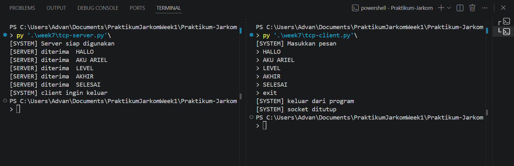
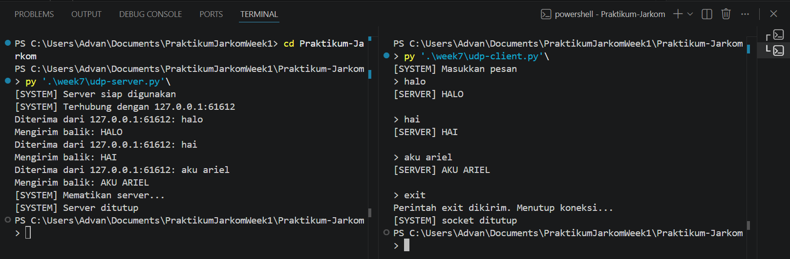

# MODUL 7 : SOCKET PROGRAMMING
- Socket Programming merupakan metode dalam pemrograman yang digunakan untuk memungkinkan komunikasi antar perangkat melalui jaringan, baik itu dalam jaringan lokal (LAN) maupun internet. Dengan socket, data dapat dikirim dan diterima menggunakan protokol jaringan seperti TCP dan UDP.

- TCP (Transmission Control Protocol) bersifat connection-oriented, sehingga memastikan data dikirim secara andal dan sampai ke tujuan. Sementara itu, UDP (User Datagram Protocol) lebih cepat karena tidak memerlukan koneksi khusus, namun tidak menjamin keutuhan atau keberhasilan pengiriman data.

- Dalam konsep dasar socket terdapat dua peran utama, yaitu server dan client. Server bertugas untuk menunggu permintaan koneksi dari client serta menerima dan mengolah data yang masuk. Sedangkan client berfungsi untuk menginisiasi koneksi ke server, kemudian mengirim dan menerima data selama proses komunikasi berlangsung.

# TCP
## TCP Client
#SOCKET = Perkalian pembagian pengurangan penjumlahan
from socket import *

serverName = 'localhost'
serverPort = 12000 

clientSocket = socket(AF_INET, SOCK_STREAM) # AF_INET = IPv4, SOCK_STREAM = TCP

clientSocket.connect((serverName, serverPort))

print("(SYSTEM) Masukkan Pesan")

running = True
while running:
    #input
    message = input('> ')

     #mengirim ke server
    #encodde = mengubah string menjadi bytes
    clientSocket.send(message.encode())

    # kalo exit = socket ditutup
    if message.lower() == 'exit':
        print("(SYSTEM) Keluar dari program")
        running = False
        break

    #menerima pesan dari server
    modifiedMessage = clientSocket.recv(2048)

    #decode = mengubah bytes menjadi string
    print("(SERVER) pesan: " + modifiedMessage.decode())

#tutup socket
clientSocket.close()
print("(SYSTEM) Socket ditutup")

## TCP Server 
from socket import *

serverPort = 12000
serverSocket = socket(AF_INET, SOCK_STREAM) # AF_INET = IPv4, SOCK_STREAM = TCP

#mengbind server 
serverSocket.bind(('', serverPort))

#server siap menerima koneksi
serverSocket.listen(1)
print("(SYSTEM) Server siap menerima koneksi")

running = True
while running:
    connectionSocket, addr = serverSocket.accept() # menerima koneksi dari client

    while True:
        message = connectionSocket.recv(2048).decode() # menerima pesan dari client

        if not message:
            break

        if message.lower() == 'exit':
            print("(SYSTEM) Client keluar dari program")
            running = False
            break

        #memodifikasi menjadi capslock
        ModifiedMessage = message.upper()
        print("(SERVER) diterima: " + ModifiedMessage)

        # kirim ke client
        connectionSocket.send(ModifiedMessage.encode())

    connectionSocket.close() # tutup koneksi dengan client
    serverSocket.close() # tutup socket server

    

1. Jalankan program server terlebih dahulu lewat terminal
2. Server akan berada dalam kondisi siap dan menunggu permintaan koneksi
3. Setelah itu, jalankan program client melalui terminal
4. Client mencoba membangun koneksi ke server
5. Client mengirimkan sebuah pesan ke server
6. Server menerima pesan tersebut, mengubahnya menjadi huruf kapital, lalu mengirimkan kembali ke client
7. Client menerima dan menampilkan balasan dari server
8. Jika client mengirimkan teks "exit", maka proses komunikasi akan dihentikan dan koneksi ditutup

# UDP
## UDP Client
from socket import *
import sys

#Konfigurasi alamat dan port server
serverName = '10.218.0.116'
serverPort = 12000

#Inisialisasi socket UDP di luar loop agar tidak dibuat berulang-ulang
clientSocket = socket(AF_INET, SOCK_DGRAM)
clientSocket.settimeout(5)  # Batas waktu tunggu 5 detik

print("Ketik 'exit' untuk mematikan server dan keluar, atau 'keluar' untuk tutup client saja.\n")

try:
    while True:
        # Input pesan dari pengguna
        message = input('Masukkan kalimat lowercase : ')
        
        # Validasi jika input kosong
        if not message:
            continue

        # Mengirim pesan ke server
        clientSocket.sendto(message.encode(), (serverName, serverPort))
        
        # Cek apakah pengguna ingin keluar
        if message.lower() == 'exit':
            print("Perintah exit dikirim. Mematikan server dan menutup klien...")
            break
        elif message.lower() == 'keluar':
            print("Menutup klien...")
            break
        
        try:
            # Menerima balasan dari server
            modifiedMessage, serverAddress = clientSocket.recvfrom(2048)
            print(f"Balasan dari Server: {modifiedMessage.decode()}\n")
        except timeout:
            print("Kesalahan : Server tidak merespons (Timeout).\n")

except Exception as e:
    print(f"Terjadi kesalahan : {e}")
finally:
    # Menutup koneksi socket secara permanen saat loop berhenti
    clientSocket.close()
    print("Koneksi ditutup.")

## UDP Server
from socket import *
import sys

#Konfigurasi server
serverPort = 12000
serverSocket = socket(AF_INET, SOCK_DGRAM)
serverSocket.bind(('', serverPort))

print(f"Server UDP siap menerima pesan pada port {serverPort}")
print("Ketik 'exit' dari sisi klien untuk mematikan server secara remote.\n")

try:
    while True:
        # Menerima pesan dari klien
        message, clientAddress = serverSocket.recvfrom(2048)
        
        # Mendekode pesan
        original_message = message.decode().strip()
        
        # Cek apakah pesan adalah perintah untuk keluar
        if original_message.lower() == 'exit':
            print(f"Mematikan server...")
            break
        
        # Mengubah pesan menjadi huruf kapital
        modifiedMessage = original_message.upper()
        
        # Menampilkan informasi klien dan isi pesan
        print(f"Diterima dari {clientAddress[0]}:{clientAddress[1]}: {original_message}")
        print(f"Mengirim balik : {modifiedMessage}")
        
        # Mengirim kembali pesan yang telah diubah ke klien
        serverSocket.sendto(modifiedMessage.encode(), clientAddress)
        
except Exception as e:
    print(f"\nTerjadi kesalahan : {e}")
finally:
    print("Server telah berhenti.")
    serverSocket.close()
    sys.exit(0)

    

    Berikut versi yang sudah diparafrase agar berbeda:

1. Program server dijalankan terlebih dahulu
2. Client kemudian mengirimkan pesan ke server
3. Server menerima pesan tersebut, mengonversinya menjadi huruf kapital, lalu mengirimkan kembali ke client
4. Client menerima dan menampilkan respon dari server
5. Apabila pesan yang dikirim adalah "exit", maka proses pada server akan dihentikan

# TCP dan UDP
## Perbedaan
Perbedaan TCP dan UDP

1. Cara Koneksi
TCP mengharuskan adanya proses pembentukan koneksi sebelum data dikirim. Sebaliknya, UDP tidak melalui tahap ini sehingga pengiriman data dapat dilakukan secara langsung.

2. Keandalan Pengiriman/data
TCP memastikan data sampai dengan lengkap dan sesuai urutan pengiriman. Sementara itu, UDP tidak memberikan jaminan terkait keberhasilan pengiriman maupun urutan data.

3. Performa / Kecepatan
Karena memiliki berbagai mekanisme pengendalian seperti pengecekan error, TCP cenderung lebih lambat. UDP lebih unggul dalam hal kecepatan karena prosesnya lebih sederhana.

4. Contoh Penggunaan
TCP umumnya digunakan untuk aplikasi yang membutuhkan ketepatan data, seperti akses website dan email. Sedangkan UDP lebih sering dimanfaatkan pada aplikasi real-time seperti streaming dan permainan online.
